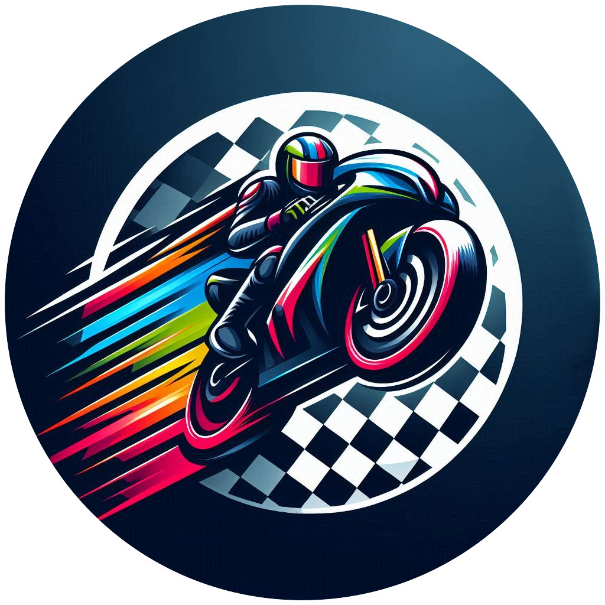

# MotoGP championship simulator
Piattaforma per la simulazione di campionati di MotoGP, sviluppata per il corso universitario "Basi di Dati II" seguito nell'anno accademico 2024/25 all'Università degli Studi di Salerno.

Sviluppo di una piattaforma web interattiva dedicata alla simulazione di campionati MotoGP personalizzati, basata sul dataset [MotoGP World Championship (1949–2022)](https://www.kaggle.com/datasets/alrizacelk/moto-gp-world-championship19492022). L'applicazione consente agli utenti di creare nuovi campionati, aggiungere o rimuovere piloti, registrare i risultati delle gare e aggiornare automaticamente la classifica. I risultati della gara sono simulati tramite un algoritmo predittivo che sfrutta le statistiche storiche dei piloti. La piattaforma è realizzata con stack moderno composto da React e Tailwind CSS per il frontend, Flask per il backend, MongoDB per la gestione dei dati e Scikit-learn per l’integrazione di funzionalità di Machine Learning.

<p align="center"> 
    
</p>

## Prerequisiti 📖
- Python installato
- Node.js e npm installati

## Installazione ⚙️
1. Installa le dipendenze Python:
   ```bash
   pip install -r requirements.txt
2. Avvia il backend:
   ```bash
   python app.py
3. Spostati nella cartella del frontend e installa le dipendenze per il frontend:
   ```bash
   cd frontend
   npm install
4. Avvia il frontend:
   ```bash
   npm run dev
5. Apri il browser e visita: http://127.0.0.1:5173

## Demo 📺
Ecco qui alcuni screenshots del simulatore!
- Homepage:
<p align="center"> 
    
</p>
- Lista piloti:
<p align="center"> 
    
</p>
- Simulazione gara:
<p align="center"> 
    
</p>
- Eventi in gara:
<p align="center"> 
    
</p>

### Credits 🙏
- [MotoGP](https://www.motogp.com/)
- [Font](https://www.deviantart.com/nerdyboy1803/art/MGP-Font-Family-1131219299)
- [Kaggle](https://www.kaggle.com/datasets/alrizacelk/moto-gp-world-championship19492022)
- [Wikipedia](https://it.wikipedia.org/wiki/MotoGP)
